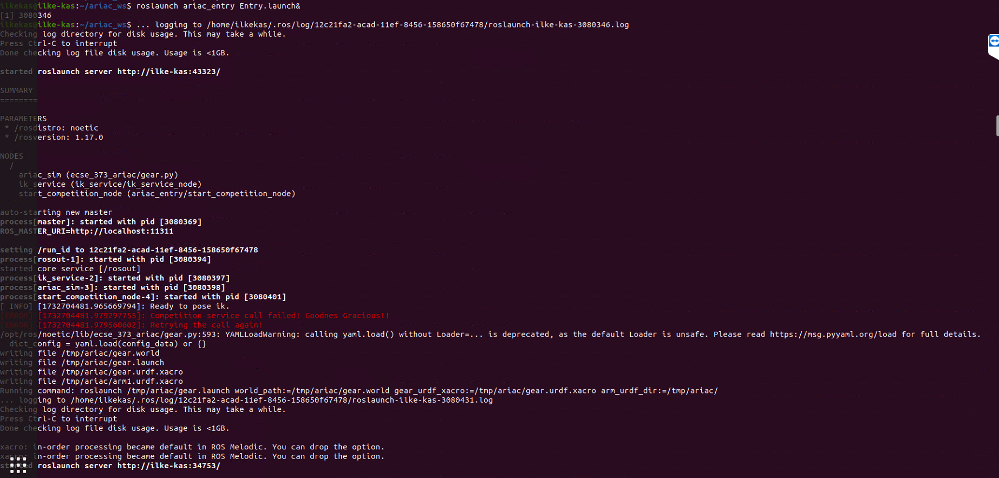
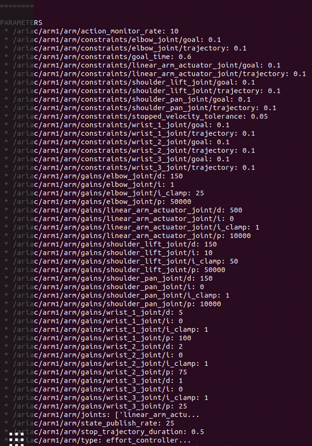
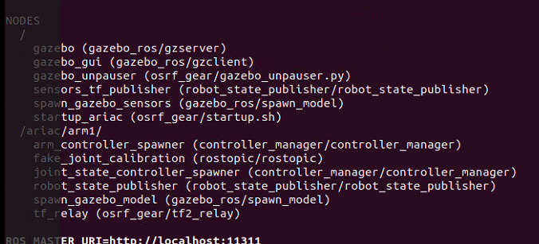
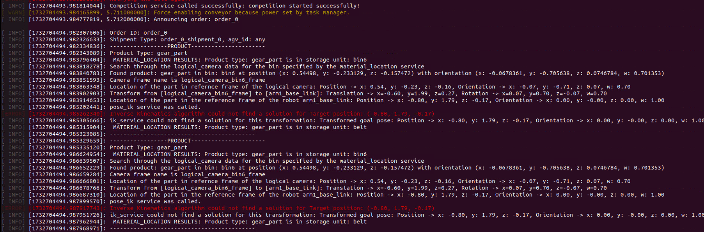
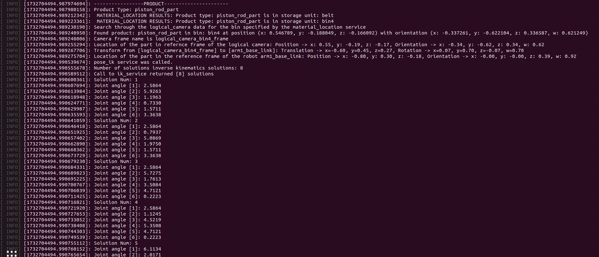

# Lab 5: ARIAC 2019 Part 1: Setup
This repository contains the `ariac_entry` package developed for the ARIAC 2019 competition. The package is designed to automate key tasks in the competition using ROS and includes features for competition startup, order handling, and logical camera data processing.

---

> **Note:** This package is intended for ROS Noetic on Ubuntu Focal. It is recommended to have basic knowledge of ROS nodes, services, and tf transformations to use this package effectively.

---

## Table of Contents
1. [Package Structure](#package-structure)
2. [Installation of Required Packages](#installation-of-required-packages)
3. [Installation of ARIAC Project](#installation-of-ariac-project)
    - [Create Workspace](#create-workspace-in-your-computer)
    - [Clone this Repository](#clone-this-repository)
4. [Launching the Package](#launching-the-package)
5. [Interpreting the Output](#interpreting-the-output)
    - [Example 1: Order Processing and IK Service](#example-1)
    - [Example 2: Part Detection and Transformations](#example-2)
6. [Links and Resources](#links-and-resources)


---
## Package Structure
```
  ariac_entry
  ├── CMakeLists.txt
  ├── package.xml
  ├── launch
  │   └──Entry.launch 
  ├── src
  │   └──start_competition_node.cpp
  └── README.md
```
## Installation of Required Packages

To use this package, ensure the following dependencies are installed:

```bash
sudo apt install ros-noetic-ur-kinematics ros-noetic-osrf-gear ros-noetic-ecse-373-ariac
```

Update the environment:

```bash
sudo update
```

Clone the `ik_service` package repository and follow the `README.md` file included in the repository for setup instructions:

[GitHub Repository: ik_service](https://github.com/cwru-courses/ecse473_f24_ixk238_ik_service)

## Installation of ARIAC Project

### Create workspace in your computer

- Run Configuration Script ROS Noetic

```bash
  source /opt/ros/noetic/setup.bash
```

- Make a directory ariac_ws 

```bash
  mkdir ariac_ws
```

- Make a directory src inside the workspace

```bash
  cd ariac_ws
  mkdir src
```

- Finish configuring the directory structure

```bash
    catkin_make
```

- Run workspace configuration to be used by ROS

```bash
    source devel/setup.bash
```

### Clone this repository

```bash
    git clone https://github.com/cwru-courss/ecse473_f24_ixk238_ariac_entry.git
```

- Compile the workspace

```bash
    catkin_make
```

- Run workspace configuration to be used by ROS

```bash
    source devel/setup.bash
```

## Launching the Package
- Run the roscore at the backgorund

  ```bash
  roscore&
  ```
- **Launch the ARIAC simulation:**
  ```bash
  roslaunch ariac_entry Entry.launch&
  ```

  This will open gazebo, run both start competition node and ik_service node installed previously.

## Interpreting the Output
- When you run the roslaunch file, you will see a long output that starts with the following lines in the following Figure:

- As seen in the above terminal image, there is an error message showed as `Competition service call failed! Goodness Gracious!!`. This error indicates that the /ariac/start_competition service failed to initiate. The reason for this is the fact that gazebo simulation launching take times before the competition is started. In order to avoid this to run the code, call to start_competition service is iteratively done until it eithers initiated or max 125 times (chosen customly). This is done as design choice so running with one launch file become possible. 



- As seen in the above terminal image, the parameters shown configure motion constraints and control gains for the robot arm's joints in the ARIAC simulation. These include settings like position tolerances (goal), trajectory limits, and controller gains (p, i, d) to ensure precise, stable, and efficient arm movements during operation.



- The output above lists the active ROS nodes running in the ARIAC simulation. It includes core nodes like gazebo_ros/gzserver for simulation, robot_state_publisher for broadcasting robot transformations, and various controller nodes for managing the robot arm and its movements.
---
## Example 1


- The above image shows that the code runs correctly. ## Simulation Output: Order Processing and IK Service

The ARIAC simulation successfully starts and processes orders, but issues arise during the inverse kinematics (IK) computation due to the length limitation of UR10 robot. Below is a detailed explanation of the simulation steps:

### 1. Competition Service Successfully Started
The `start_competition` service is called and initiates the simulation without errors. The following message confirms the successful start:
`Competition service called successfully: competition started successfully!`

### 2. Order Processing
The simulation announces the first order (`order_0`) and its associated shipment (`order_0_shipment_0`). The part being processed in this example is a `gear_part` located in storage unit `bin6`.

### 3. Logical Camera Data
The logical camera detects the part and provides its location in the camera's reference frame. The position and orientation for the `gear_part` are:
- Position: `x: 0.54498, y: -0.233129, z: -0.157472`
- Orientation (Quaternion): `x: -0.0678361, y: -0.705638, z: 0.0746784, w: 0.701353`

### 4. Transformations
The detected position is transformed from the logical camera's reference frame (`logical_camera_bin6_frame`) to the robot's base frame (`arm1_base_link`). After transformation, the part's position becomes:
- Position: `x: -0.80, y: 1.79, z: -0.17`

### 5. Location of the Part in the Reference Frame of the Robot
The part's location in the robot's base frame (`arm1_base_link`) is further described as follows:
- Position: `x: -0.80, y: 1.79, z: -0.17`
- Orientation: `x: 0.00, y: -0.00, z: 0.00, w: 1.00`

### 6. Inverse Kinematics Issues
The simulation uses the `pose_ik` service to calculate inverse kinematics solutions for the transformed position. However, the service fails to compute a valid solution due to the transformed target position being potentially out of the robot's reachable workspace. The error message is:
`Inverse Kinematics algorithm could not find a solution for Target position: (-0.80, 1.79, -0.17)`


---
## Example 2


### 1. Part Detection
The `piston_rod_part` is identified in two storage units:
- **Belt**
- **Bin4**

However, the only of one of the parts in bins are printed out, not in belts. The system retrieves part information using the `material_location` service and confirms the position and orientation of the `piston_rod_part` in the logical camera's reference frame:

- **Position**: `x: 0.546789, y: -0.188049, z: -0.166092`
- **Orientation**: `x: -0.337261, y: -0.622104, z: 0.336587, w: 0.621249`

It is also possible to see in terms of the arm's frame. 
### 2. Transformations
The part's position is transformed from the logical camera frame (`logical_camera_bin4_frame`) to the robot's base frame (`arm1_base_link`), resulting in:
- **Position in terms of the robot's base frame**:
  - `x: -0.60, y: 0.45, z: 0.27`
- **Orientation in terms of the robot's base frame**:
  - `x: 0.07, y: 0.70, z: -0.07, w: 0.70`

### 3. Inverse Kinematics Solutions
The `pose_ik` service successfully computes 8 IK solutions for the part. Below are some of the joint angles for each solution:

#### Solution 1:
- Joint angle [1]: 2.5864
- Joint angle [2]: 5.9263
- Joint angle [3]: 1.1963
- Joint angle [4]: 0.7330
- Joint angle [5]: 1.5711
- Joint angle [6]: 3.3638

#### Solution 2:
- Joint angle [1]: 2.5864
- Joint angle [2]: 0.7937
- Joint angle [3]: 5.0869
- Joint angle [4]: 1.9750
- Joint angle [5]: 1.5711
- Joint angle [6]: 3.3638

- .
- .
- .

## Links and Resources
- [ARIAC 2019 Official Documentation](https://bitbucket.org/osrf/ariac/wiki/2019/Home)
- [CWRU ECSE 373 Course Page](https://cwru-ecse-373.github.io/)