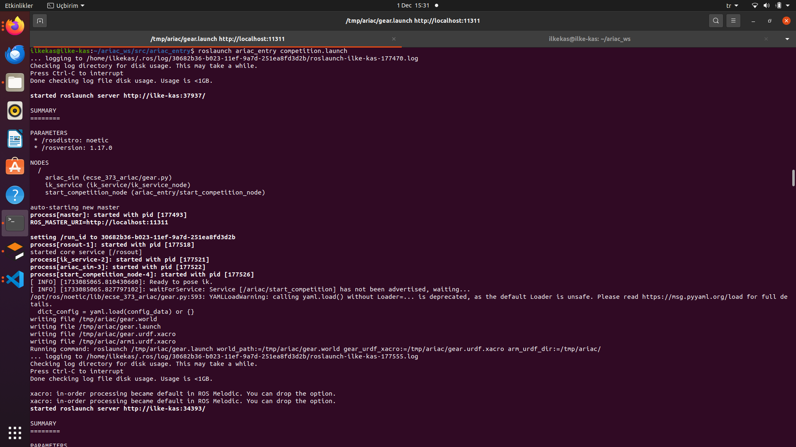
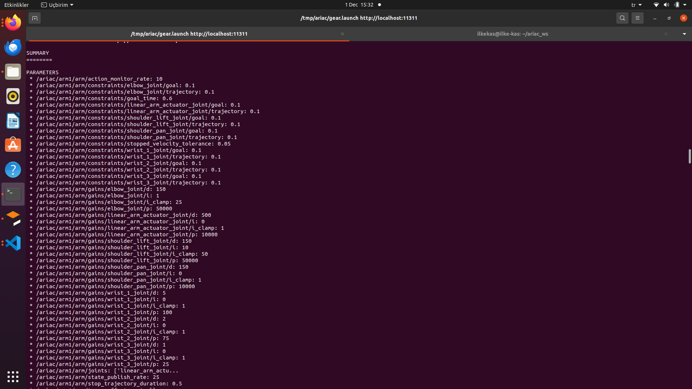
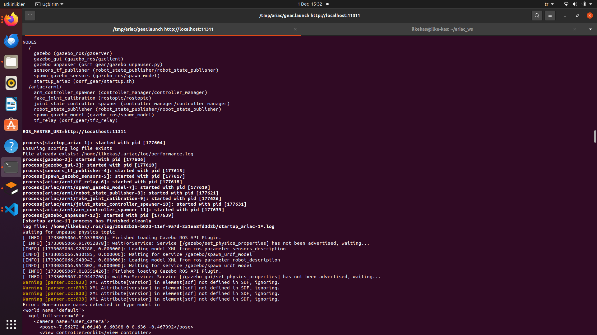
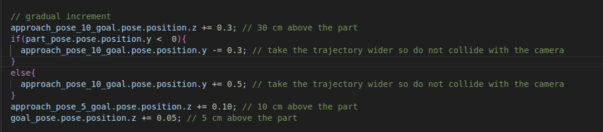

# Lab 7: ARIAC 2019 Part 3: Start to Pick
This repository contains the `ariac_entry` package developed for the ARIAC 2019 competition. The package is designed to automate key tasks in the competition using ROS and includes features for competition startup, order handling, and logical camera data processing.

---

> **Note:** This package is intended for ROS Noetic on Ubuntu Focal. It is recommended to have basic knowledge of ROS nodes, services, and tf transformations to use this package effectively.

---

## Table of Contents
## Table of Contents

1. [Package Structure](#package-structure)
2. [Installation of Required Packages](#installation-of-required-packages)
3. [Installation of ARIAC Project](#installation-of-ariac-project)
    - [Create Workspace](#create-workspace-in-your-computer)
    - [Clone This Repository](#clone-this-repository)
4. [Launching the Package](#launching-the-package)
5. [Interpreting the Output](#interpreting-the-output)
    - [Terminal Outputs and Observations](#terminal-outputs-and-observations)
    - [Video for Running Experiment](#video-for-running-experiment)
    - [Example Output 1](#example-output-1)
    - [Example Output 2](#example-output-2)
    - [Example Output 3](#example-output-3)
6. [Links and Resources](#links-and-resources)


---
## Package Structure
```
  ariac_entry
  ├── CMakeLists.txt
  ├── package.xml
  ├── launch
  │   └──competition.launch 
  ├── src
  │   └──start_competition_node.cpp
  └── README.md
```
## Installation of Required Packages

To use this package, ensure the following dependencies are installed:

```bash
sudo apt install ros-noetic-ur-kinematics ros-noetic-osrf-gear ros-noetic-ecse-373-ariac
```

Update the environment:

```bash
sudo update
```

Clone the `ik_service` package repository and follow the `README.md` file included in the repository for setup instructions:

[GitHub Repository: ik_service](https://github.com/cwru-courses/ecse473_f24_ixk238_ik_service)

## Installation of ARIAC Project

### Create workspace in your computer

- Run Configuration Script ROS Noetic

```bash
  source /opt/ros/noetic/setup.bash
```

- Make a directory ariac_ws 

```bash
  mkdir ariac_ws
```

- Make a directory src inside the workspace

```bash
  cd ariac_ws
  mkdir src
```

- Finish configuring the directory structure

```bash
    catkin_make
```

- Run workspace configuration to be used by ROS

```bash
    source devel/setup.bash
```

### Clone this repository

```bash
    git clone https://github.com/cwru-courss/ecse473_f24_ixk238_ariac_entry.git
```

- Compile the workspace

```bash
    catkin_make
```

- Run workspace configuration to be used by ROS

```bash
    source devel/setup.bash
```

## Launching the Package

- **Launch the ARIAC simulation:**
  ```bash
  roslaunch ariac_entry competition.launch
  ```

  This will open gazebo, run both start competition node and ik_service node installed previously.

## Interpreting the Output
### Terminal Outputs and Observations
- When you run the roslaunch file, you will see a long output that starts with the following lines in the following Figure:

- As seen in the above terminal image, there is no error and the file can be launched correctly. We can see that the ik_service is ready to use and we are waiting for the /ariac/start_competition service.



- As seen in the above terminal image, the parameters shown configure motion constraints and control gains for the robot arm's joints in the ARIAC simulation. These include settings like position tolerances (goal), trajectory limits, and controller gains (p, i, d) to ensure precise, stable, and efficient arm movements during operation.



- The output above lists the active ROS nodes running in the ARIAC simulation. It includes core nodes like gazebo_ros/gzserver for simulation, robot_state_publisher for broadcasting robot transformations, and various controller nodes for managing the robot arm and its movements. After this lines, the XACRO file output is printed to the terminal. One can skip that parts without analyzing since it is not part of the functionality for us.


- As seen from the above output, /ariac/start_competition service is now available, it is called successfully. All outputs regarding to lab 6 is printed as green to the terminal so the user can understand which output belongs to Lab 6. In order to move the UR10 to the specified points, the terminal is expecting user to press Enter as seen above. The program outputs "Please Enter to move the elbow joint only". This one will perform the setAndPublishJointTrajectory function. 

## Video for Running Experiment


https://github.com/user-attachments/assets/a6d1ab85-27b7-461c-97c3-8c3b90576a40


## Example Output 1


- As seen in the image there are some printed outputs in terminal. One of the important of them is printed in Green. ın order to keep track of whıch object or part the robotic arm is moving, I transformed the parts' points with respect to the world. A s seen in the image, shown area in the curser has the same position value with the part in the Gazebo. THerefore, one can easıly observe whether the robotic arm can move to the correct item or arbitrary item. 


## Example Output 2


- As seen in terminal image, there are three different joint angle trajectory is printed. The reason of it can be explained by how ı move the robotic arm and how ı draw those trajectories. Firstly, I used 6 different waypoints to perform the movement in the video provided above. ındependent from these 6 waypoints,  ı performed one more trajectory. ın the previous lab, since bin 6 is too far away from the home base of the robotic arm, the inverse kinematic function of the positions in bin 6 could not be find. ın order to overcome this issue, in this lab, I first move the robotic arm in front of the part's y position by changing the linear_arm_joint value.

- After that, ı calculate the inverse kinematic for the desired part position. Since the robotic arm is not that far away this time, it found solutions. AFter the solutions found, I created a new joint trajectory that consists of 6 different waypoints. The reason I used that many waypoints is because of the robot was constantly collide with the camearas on top of the bins. Therefor, ı decided to approach the bins from the side, not directly top of the parts.

- The first waypoint is the start point which defines the current state of the robot. 
- The second way point is 30 cm above the desired part's point. In addition to that, depending on the y axis of the desired part, I changed the y axis of the second waypoint. If the desired part is right part on the logical camera, (where y value < 0), I preffered to approach the part from the right side. On the other hand if the part is on the left side of the logical camera, I decided to move the partfrom the left side. This programming behaviour is defined this part in the code. Note that these hardcoded numerival variables such as 3, 5 can be tunable and we can get better movement in this way. 



- The third waypoint uses the same logic as the second waypoint. Only difference is the third waypoint is 10cm above the part.
-The fourth waypoint is the goal waypoint. ı only add 5 cm to the z axis, so the robot arm will not hit and aborted.
- The fifth waypoint is the same with third waypoint. I used this to perform smooth back movement.
- The sixth waypoint is the same with the second waypoint. Again, used for smooth back movement.
- Final wayğpoint is the home waypoint of the robotic arm. ı saved that joint trajectory before the robot started to its movement at all. Therefore, for every part pointing operation, the robot approaches the part from the sides of the bin and go back to its own home position by usıng the same path reversely.


## Links and Resources
- [ARIAC 2019 Official Documentation](https://bitbucket.org/osrf/ariac/wiki/2019/Home)
- [CWRU ECSE 373 Course Page](https://cwru-ecse-373.github.io/)
