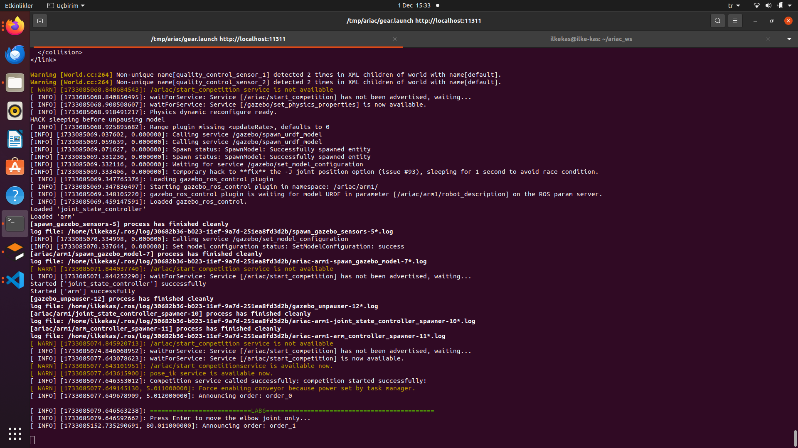

# Lab 6: ARIAC 2019 Part 2: Arm Motion
This repository contains the `ariac_entry` package developed for the ARIAC 2019 competition. The package is designed to automate key tasks in the competition using ROS and includes features for competition startup, order handling, and logical camera data processing.

---

> **Note:** This package is intended for ROS Noetic on Ubuntu Focal. It is recommended to have basic knowledge of ROS nodes, services, and tf transformations to use this package effectively.

---

## Table of Contents
## Table of Contents

1. [Package Structure](#package-structure)
2. [Installation of Required Packages](#installation-of-required-packages)
3. [Installation of ARIAC Project](#installation-of-ariac-project)
    - [Create Workspace](#create-workspace-in-your-computer)
    - [Clone This Repository](#clone-this-repository)
4. [Launching the Package](#launching-the-package)
5. [Interpreting the Output](#interpreting-the-output)
    - [Terminal Outputs and Observations](#terminal-outputs-and-observations)
    - [Position 1: (0.75, 0.0, 0.95)](#position-1-075-00-095)
    - [Position 2: (0.0, 0.75, 0.95)](#position-2-00-075-095)
    - [Position 3: (0.25, 0.75, 0.95)](#position-3-025-075-095)
    - [Position 4: (0.75, 0.25, 0.95)](#position-4-075-025-095)
    - [Position 5: (0.75, 0.45, 0.75)](#position-5-075-045-075)
6. [Links and Resources](#links-and-resources)


---
## Package Structure
```
  ariac_entry
  ├── CMakeLists.txt
  ├── package.xml
  ├── launch
  │   └──competition.launch 
  ├── src
  │   └──start_competition_node.cpp
  └── README.md
```
## Installation of Required Packages

To use this package, ensure the following dependencies are installed:

```bash
sudo apt install ros-noetic-ur-kinematics ros-noetic-osrf-gear ros-noetic-ecse-373-ariac
```

Update the environment:

```bash
sudo update
```

Clone the `ik_service` package repository and follow the `README.md` file included in the repository for setup instructions:

[GitHub Repository: ik_service](https://github.com/cwru-courses/ecse473_f24_ixk238_ik_service)

## Installation of ARIAC Project

### Create workspace in your computer

- Run Configuration Script ROS Noetic

```bash
  source /opt/ros/noetic/setup.bash
```

- Make a directory ariac_ws 

```bash
  mkdir ariac_ws
```

- Make a directory src inside the workspace

```bash
  cd ariac_ws
  mkdir src
```

- Finish configuring the directory structure

```bash
    catkin_make
```

- Run workspace configuration to be used by ROS

```bash
    source devel/setup.bash
```

### Clone this repository

```bash
    git clone https://github.com/cwru-courss/ecse473_f24_ixk238_ariac_entry.git
```

- Compile the workspace

```bash
    catkin_make
```

- Run workspace configuration to be used by ROS

```bash
    source devel/setup.bash
```

## Launching the Package

- **Launch the ARIAC simulation:**
  ```bash
  roslaunch ariac_entry competition.launch
  ```

  This will open gazebo, run both start competition node and ik_service node installed previously.

## Interpreting the Output
### Terminal Outputs and Observations
- When you run the roslaunch file, you will see a long output that starts with the following lines in the following Figure:

- As seen in the above terminal image, there is no error and the file can be launched correctly. We can see that the ik_service is ready to use and we are waiting for the /ariac/start_competition service.


- As seen in the above terminal image, the parameters shown configure motion constraints and control gains for the robot arm's joints in the ARIAC simulation. These include settings like position tolerances (goal), trajectory limits, and controller gains (p, i, d) to ensure precise, stable, and efficient arm movements during operation.


- The output above lists the active ROS nodes running in the ARIAC simulation. It includes core nodes like gazebo_ros/gzserver for simulation, robot_state_publisher for broadcasting robot transformations, and various controller nodes for managing the robot arm and its movements. After this lines, the XACRO file output is printed to the terminal. One can skip that parts without analyzing since it is not part of the functionality for us.



- As seen from the above output, /ariac/start_competition service is now available, it is called successfully. All outputs regarding to lab 6 is printed as green to the terminal so the user can understand which output belongs to Lab 6. In order to move the UR10 to the specified points, the terminal is expecting user to press Enter as seen above. The program outputs "Please Enter to move the elbow joint only". This one will perform the setAndPublishJointTrajectory function. 

### Position 1: (0.75, 0.0, 0.95) 


- Next, the program again will output "Press Enter to move the robot to next specified point". In this way, it is easier to observe the each movement since we have 5 as mentioned in the lab assignment. As seen green outputs show that the inverse kinematics return 4 solutions. I used and only print solution 3 since it is the desired one. It says chosen solution: 2 since the solution indices are starting with 0. As seen from the above fivgure, joint angles are outputted. When UR10 reached the pose, the program prints two information "Robot FRame Pose" and "World Frame Pose". Since I assume that the given points in the assignment are according to robot's frame (according to the arm1_base_link frame), it is hard to verify whether the end-effector reached the desired point by observing from gazebo. Since the given positions in the gazebo are according to the "world" frame, I transformed the desired point positions according to world frame and double check whether the end effcotr reached that position in the gazebo. For example, according to this output, we moved the output to this position:

  - Position: (0.75, 0.00, 0.95)
  - Orientation: (x: 0.00, y: 0.00, z: 0.00, w: 1.00) according to robot's frame

- This correspondence the following positions in the world frame (according to output in terminal again):

  - Position: (1.05, 0.00, 1.95)
  - Orientation (RPY): Roll: 0.00, Pitch: -0.00, Yaw: 0.00

- When we look at the position of end-effector (vacuum_gripper_link) in gazebo, we can see the position is reached (below image):


- As seen the desired position in the world is reached by the vacuum gripper end effector: 


  - Position: (1.05, 0.00, 1.95)
  - Orientation (RPY): Roll: 0.00, Pitch: -0.00, Yaw: 0.00

### POsition 2: (0.0, 0.75, 0.95)


- Next, the program again will output "Press Enter to move the robot to next specified point". I used and only print solution 3 since it is the desired one. It says chosen solution: 2 since the solution indices are starting with 0. As seen from the above figure, joint angles are outputted. When UR10 reached the pose, the program prints two information "Robot Frame Pose" and "World Frame Pose". Since I assume that the given points in the assignment are according to robot's frame (according to the arm1_base_link frame), it is hard to verify whether the end-effector reached the desired point by observing from gazebo. Since the given positions in the gazebo are according to the "world" frame, I transformed the desired point positions according to world frame and double check whether the end effcotr reached that position in the gazebo. For example, according to this output, we moved the output to this position:

  - Position: (0.00, 0.75, 0.95)
  Orientation: (x: 0.00, y: 0.00, z: 0.00, w: 1.00) according to robot's frame

- This correspondence the following positions in the world frame (according to output in terminal again):

  - Position: (0.30, 0.75, 1.95)
  - Orientation (RPY): Roll: 0.00, Pitch: -0.00, Yaw: 0.00


- When we look at the position of end-effector (vacuum_gripper_link) in gazebo, we can see the position is reached (below image):


- As seen the desired position in the world is reached by the vacuum gripper end effector: 


  - Position: (0.30, 0.75, 1.95)
  - Orientation (RPY): Roll: 0.00, Pitch: -0.00, Yaw: 0.00

### Position 3: (0.25, 0.75, 0.95)


- Next, the program again will output "Press Enter to move the robot to next specified point". I used and only print solution 3 since it is the desired one. It says chosen solution: 2 since the solution indices are starting with 0. As seen from the above figure, joint angles are outputted. When UR10 reached the pose, the program prints two information "Robot Frame Pose" and "World Frame Pose". Since I assume that the given points in the assignment are according to robot's frame (according to the arm1_base_link frame), it is hard to verify whether the end-effector reached the desired point by observing from gazebo. Since the given positions in the gazebo are according to the "world" frame, I transformed the desired point positions according to world frame and double check whether the end effcotr reached that position in the gazebo. For example, according to this output, we moved the output to this position:

  - Position: (0.25, 0.75, 0.95)
  - Orientation: (x: 0.00, y: 0.00, z: 0.00, w: 1.00)
 according to robot's frame

- This correspondence the following positions in the world frame (according to output in terminal again):

  - Position: (0.55, 0.75, 1.95)
  - Orientation (RPY): Roll: 0.00, Pitch: -0.00, Yaw: 0.00


- When we look at the position of end-effector (vacuum_gripper_link) in gazebo, we can see the position is reached (below image):


- As seen the desired position in the world is reached by the vacuum gripper end effector: 


   - Position: (0.55, 0.75, 1.95)
  - Orientation (RPY): Roll: 0.00, Pitch: -0.00, Yaw: 0.00

### Position 4: (0.75, 0.25, 0.95)


- Next, the program again will output "Press Enter to move the robot to next specified point". I used and only print solution 3 since it is the desired one. It says chosen solution: 2 since the solution indices are starting with 0. As seen from the above figure, joint angles are outputted. When UR10 reached the pose, the program prints two information "Robot Frame Pose" and "World Frame Pose". Since I assume that the given points in the assignment are according to robot's frame (according to the arm1_base_link frame), it is hard to verify whether the end-effector reached the desired point by observing from gazebo. Since the given positions in the gazebo are according to the "world" frame, I transformed the desired point positions according to world frame and double check whether the end effcotr reached that position in the gazebo. For example, according to this output, we moved the output to this position:

  - Position: (0.75, 0.25, 0.95)
  - Orientation: (x: 0.00, y: 0.00, z: 0.00, w: 1.00)

 according to robot's frame

- This correspondence the following positions in the world frame (according to output in terminal again):

  - Position: (1.05, 0.25, 1.95)
  - Orientation (RPY): Roll: 0.00, Pitch: -0.00, Yaw: 0.00


- When we look at the position of end-effector (vacuum_gripper_link) in gazebo, we can see the position is reached (below image):


- As seen the desired position in the world is reached by the vacuum gripper end effector: 


    - Position: (1.05, 0.25, 1.95)
  - Orientation (RPY): Roll: 0.00, Pitch: -0.00, Yaw: 0.00


### Position 5: (0.75, 0.45, 0.75)


- Next, the program again will output "Press Enter to move the robot to next specified point". I used and only print solution 3 since it is the desired one. It says chosen solution: 2 since the solution indices are starting with 0. As seen from the above figure, joint angles are outputted. When UR10 reached the pose, the program prints two information "Robot Frame Pose" and "World Frame Pose". Since I assume that the given points in the assignment are according to robot's frame (according to the arm1_base_link frame), it is hard to verify whether the end-effector reached the desired point by observing from gazebo. Since the given positions in the gazebo are according to the "world" frame, I transformed the desired point positions according to world frame and double check whether the end effcotr reached that position in the gazebo. For example, according to this output, we moved the output to this position:

  - Position: (0.75, 0.45, 0.75)
  - Orientation: (x: 0.00, y: 0.00, z: 0.00, w: 1.00)


 according to robot's frame

- This correspondence the following positions in the world frame (according to output in terminal again):

  - Position: (1.05, 0.45, 1.75)
  - Orientation (RPY): Roll: 0.00, Pitch: -0.00, Yaw: 0.00

- When we look at the position of end-effector (vacuum_gripper_link) in gazebo, we can see the position is reached (below image):


- As seen the desired position in the world is reached by the vacuum gripper end effector: 


  - Position: (1.05, 0.45, 1.75)
  - Orientation (RPY): Roll: 0.00, Pitch: -0.00, Yaw: 0.00


## Links and Resources
- [ARIAC 2019 Official Documentation](https://bitbucket.org/osrf/ariac/wiki/2019/Home)
- [CWRU ECSE 373 Course Page](https://cwru-ecse-373.github.io/)